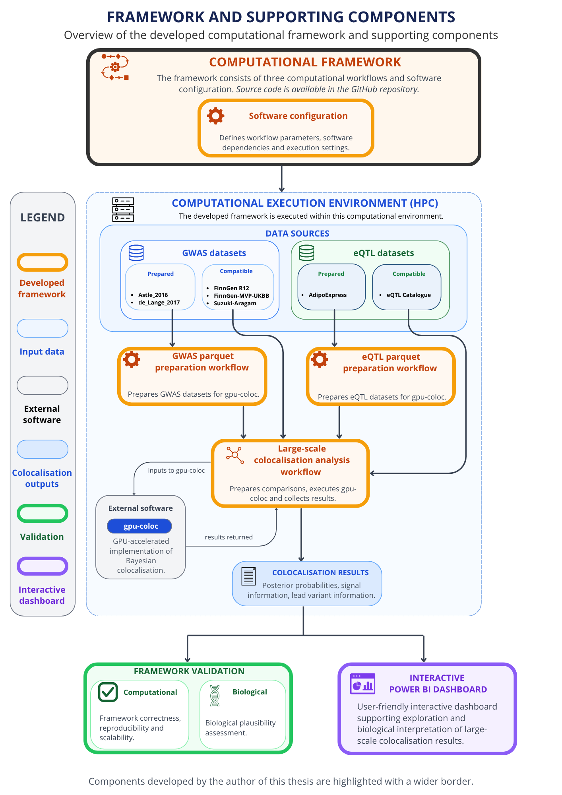

# gpu-coloc-workflow-portable

A modular Nextflow DSL2 framework for preparing GWAS and eQTL datasets for gpu-coloc and performing large-scale Bayesian genetic colocalisation analyses using gpu-coloc on HPC systems.

This repository contains the computational framework developed as part of the Master's thesis *Development of a scalable automated computational framework for genetic colocalisation analysis* at the University of Tartu.

The framework consists of three computational workflows constructed from reusable Nextflow DSL2 modules:

- GWAS parquet preparation
- eQTL parquet preparation
- Large-scale colocalisation analysis

The framework also includes supporting software configuration and is intended for execution in a SLURM-managed HPC environment, such as the University of Tartu Rocket HPC cluster.

---

## Framework overview

The computational framework consists of three workflows constructed from reusable Nextflow DSL2 modules and supporting software configuration.

The GWAS and eQTL parquet preparation workflows transform compatible input datasets into gpu-coloc compatible parquet representations. These outputs can be used as input for the large-scale colocalisation analysis workflow or reused in future gpu-coloc analyses without repeating dataset preparation.

The large-scale colocalisation analysis workflow generates GWAS-eQTL dataset comparisons and executes gpu-coloc analyses. The resulting colocalisation outputs can be used for downstream exploration and biological interpretation.



---

## Quick start

For first-time users who want to test the framework without going through the detailed documentation, the steps below provide a short example using the de_Lange_2017 GWAS parquet preparation workflow.

The example assumes that the required de_Lange_2017 input data are available on the University of Tartu Rocket HPC cluster.


### 1. Connect to the HPC environment

Connect to the University of Tartu Rocket HPC cluster using SSH. When connecting from outside the University of Tartu network, first connect to the University VPN. See the [University of Tartu VPN documentation](https://wiki.ut.ee/spaces/IT/pages/199673384/VPN) for setup instructions.

For example, on Windows, one option is to use Git Bash to connect to Rocket:

```bash
ssh <username>@rocket.hpc.ut.ee
```

Replace `<username>` with your University of Tartu username.

For additional information about accessing Rocket, see the [University of Tartu HPC quick-start guide](https://docs.hpc.ut.ee/public/cluster/First_steps/quickstart/#cluster-login). More general information about using the HPC environment is available in the [University of Tartu HPC documentation](https://docs.hpc.ut.ee/public/).

### 2. Clone the repository

```bash
git clone https://github.com/JAAN555/gpu-coloc-workflow-portable.git
cd gpu-coloc-workflow-portable
```

### 3. Create and activate the software environment

```bash
bash setup_gpucoloc.sh
source env.sh
```

### 4. Configure the workflow parameters

The provided parameter file can be used without modification if the default parameter values are suitable for the analysis and the input data are available at the configured location.

Otherwise, create or replace the parameter file with the required values:

```bash
cat > params/params_prepare_de_lange.yml <<'EOF'
...
EOF
```

### 5. Submit the workflow

```bash
sbatch sbatch/run_prepare_de_lange.sbatch
```

### 6. Monitor the workflow

```bash
squeue -u $USER
```

The workflow output and error logs can also be inspected using the `.out` and `.err` files defined in the SLURM submission script.

For detailed information about workflow configuration, execution, monitoring, and outputs, see [Workflow configuration and execution](#workflow-configuration-and-execution).

---

## Repository structure

| Path                                                 | Description                                                                                                                    |
| ---------------------------------------------------- | ------------------------------------------------------------------------------------------------------------------------------ |
| `configs/`                                           | Nextflow execution configuration files.                                                                                        |
| `figures/`                                           | Figures used in the repository documentation.                                                                                  |
| `gpu_coloc/`                                         | gpu-coloc code used for Bayesian genetic colocalisation analysis. See `gpu_coloc/README.md` for attribution and citation information. |
| `modules/`                                           | Reusable Nextflow DSL2 modules used by the workflows. See `modules/README.md` for module descriptions.                         |
| `params/`                                            | Workflow parameter files.                                                                                                      |
| `reproducibility/`                                   | Software environment records used to support reproducibility.                                                                  |
| `sbatch/`                                            | SLURM scripts for workflow execution.                                                                                          |
| `scripts/`                                           | Python scripts used by the workflows.                                                                                          |
| `main_prepare_astle_parquets_modular.nf`             | GWAS parquet preparation workflow for Astle_2016.                                                                              |
| `main_prepare_de_lange_parquets_modular.nf`          | GWAS parquet preparation workflow for de_Lange_2017.                                                                           |
| `main_prepare_adipoexpress_eqtl_parquets_modular.nf` | eQTL parquet preparation workflow for AdipoExpress.                                                                            |
| `main_coloc_comparisons_modular.nf`                  | Large-scale colocalisation analysis workflow.                                                                                  |
| `environment.yml`                                    | Conda environment specification.                                                                                               |
| `setup_gpucoloc.sh`                                  | Script for creating or updating the Conda environment.                                                                         |
| `env.sh`                                             | Script for activating the Conda environment.                                                                                   |
| `THIRD_PARTY_LICENSES.md`                            | Copyright and license information for third-party code used or adapted in the framework.                                       |


---

## Workflows

The computational framework contains three workflows for dataset preparation and large-scale Bayesian genetic colocalisation analysis.

### GWAS parquet preparation workflow

Transforms compatible harmonised GWAS summary statistics into gpu-coloc compatible parquet representations.

The workflow consists of reusable modules for dataset discovery, signal generation, chromosome-level parquet generation, and final parquet assembly. Additional information about the modules is available in [`modules/README.md`](modules/README.md).

### eQTL parquet preparation workflow

Transforms compatible processed eQTL data into gpu-coloc compatible parquet representations.

The current implementation was developed for the AdipoExpress resource and consists of reusable modules for dataset discovery, signal construction, chromosome-level parquet generation, and final parquet assembly. Additional information about the modules is available in [`modules/README.md`](modules/README.md).

### Large-scale colocalisation analysis workflow

Automates Bayesian genetic colocalisation analyses using gpu-coloc compatible GWAS and eQTL parquet resources.

The workflow generates GWAS-eQTL dataset comparisons and executes gpu-coloc independently for each comparison. Additional information about the workflow modules is available in [`modules/README.md`](modules/README.md).

---

## Setup

### First-time setup

Clone the repository and create the Conda environment.

```bash
git clone https://github.com/JAAN555/gpu-coloc-workflow-portable.git
cd gpu-coloc-workflow-portable

bash setup_gpucoloc.sh
source env.sh
```


### Subsequent sessions

Activate the existing Conda environment.

```bash
cd gpu-coloc-workflow-portable
source env.sh
```


### Optional Conda environment name

By default, the setup creates and activates the Conda environment
`gpucoloc_nf`.

To use a different environment name, set `GPUCOLOC_ENV_NAME` before setup:

```bash
export GPUCOLOC_ENV_NAME=gpucoloc_nf_test
bash setup_gpucoloc.sh
source env.sh
```
---

## Workflow configuration and execution

Each workflow uses a main Nextflow file together with parameter, execution configuration, and SLURM submission files:

- **Main workflow (`.nf`)** - defines the workflow and the order in which its modules are executed.
- **Parameter file (`.yml`)** - contains input and output locations and workflow parameters. Parameter values can be changed for different analyses.
- **Execution configuration (`.config`)** - defines the computational resources and other execution settings for the workflow.
- **SLURM submission script (`.sbatch`)** - starts the workflow on a SLURM-managed HPC environment using the selected workflow, parameter, and configuration files.

The files used for the provided workflow executions are shown below.

| Workflow | Main workflow | Parameter file | Execution configuration | SLURM script |
|---|---|---|---|---|
| Astle_2016 GWAS parquet preparation | [`main_prepare_astle_parquets_modular.nf`](main_prepare_astle_parquets_modular.nf) | [`params_prepare_astle_36_fillminus1e6.yml`](params/params_prepare_astle_36_fillminus1e6.yml) | [`prepare_astle_parquets_modular.config`](configs/prepare_astle_parquets_modular.config) | [`run_prepare_astle_36_fillminus1e6.sbatch`](sbatch/run_prepare_astle_36_fillminus1e6.sbatch) |
| de_Lange_2017 GWAS parquet preparation | [`main_prepare_de_lange_parquets_modular.nf`](main_prepare_de_lange_parquets_modular.nf) | [`params_prepare_de_lange.yml`](params/params_prepare_de_lange.yml) | [`prepare_de_lange_parquets_modular.config`](configs/prepare_de_lange_parquets_modular.config) | [`run_prepare_de_lange.sbatch`](sbatch/run_prepare_de_lange.sbatch) |
| AdipoExpress eQTL parquet preparation | [`main_prepare_adipoexpress_eqtl_parquets_modular.nf`](main_prepare_adipoexpress_eqtl_parquets_modular.nf) | [`params_prepare_adipoexpress.yml`](params/params_prepare_adipoexpress.yml) | [`prepare_adipoexpress_eqtl_parquets.config`](configs/prepare_adipoexpress_eqtl_parquets.config) | [`run_prepare_adipoexpress_eqtl.sbatch`](sbatch/run_prepare_adipoexpress_eqtl.sbatch) |
| Large-scale colocalisation analysis (5 × 6) | [`main_coloc_comparisons_modular.nf`](main_coloc_comparisons_modular.nf) | [`params_coloc_comparisons_astle_m1e6_5x6.yml`](params/params_coloc_comparisons_astle_m1e6_5x6.yml) | [`coloc_comparisons_modular.config`](configs/coloc_comparisons_modular.config) | [`run_coloc_astle_m1e6_5x6.sbatch`](sbatch/run_coloc_astle_m1e6_5x6.sbatch) |

### Configuring workflow parameters

Before running a workflow, the corresponding parameter file in [`params/`](params/) should be updated for the analysis. Parameter files contain input and output locations and workflow-specific parameter values.

For example, the parameter file for the Astle_2016 GWAS parquet preparation workflow can be created or replaced using:

```bash
cat > params/params_prepare_astle_36_fillminus1e6.yml <<'EOF'
outdir: "nf_out_prepare_astle_parquets_modular_36_fillminus1e6"

summary_stats_root: "/path/to/summary_stats"

gwas_dataset_name: "Astle_2016"
gwas_pattern: "GWASCatalog/Astle_2016/**/harmonised/*.h.tsv.gz"

gwas_limit: 36

gwas_chr: ""
gwas_window: 1000000
gwas_chunksize: 500000

gwas_min_lbf: 5.0
gwas_lead_p: 5e-8
gwas_effect_prior: 0.2

coloc_group_merge_gap: 0
max_signals_per_group: 20
EOF
```

Parameter values can be modified based on the requirements of the analysis. The `summary_stats_root` placeholder should be replaced with the location of the input GWAS summary statistics.

### Running a workflow

The provided SLURM submission scripts are located in [`sbatch/`](sbatch/). A workflow can be submitted using:

```bash
sbatch sbatch/<script>.sbatch
```

For example, to run the GWAS parquet preparation workflow for Astle_2016:

```bash
sbatch sbatch/run_prepare_astle_36_fillminus1e6.sbatch
```

### Monitoring workflow execution

After submitting a workflow, the SLURM job can be monitored using:

```bash
squeue -u $USER
```

The SLURM submission scripts also define output (`.out`) and error (`.err`) log files. The exact filenames are specified by the `#SBATCH --output` and `#SBATCH --error` settings in the corresponding submission script.

For example, the large-scale colocalisation analysis uses:

```bash
#SBATCH --output=nf_coloc_astle_m1e6.%j.out
#SBATCH --error=nf_coloc_astle_m1e6.%j.err
```

Here, `%j` is replaced by the SLURM job ID. For example, if the submitted job ID is `123456`, the workflow output can be viewed using:

```bash
cat nf_coloc_astle_m1e6.123456.out
```

and errors can be viewed using:

```bash
cat nf_coloc_astle_m1e6.123456.err
```

### Workflow outputs

The GWAS and eQTL parquet preparation workflows write their outputs to the directory specified by the `outdir` parameter in the corresponding parameter file.

The final gpu-coloc compatible parquet resource is located in the grouped root output directory. For example, a prepared GWAS resource may be located at:

```text
/path/to/nf_out_prepare_de_lange_parquets_modular_36_fillminus1e6/03_gwas_grouped_root/gwas_grouped
```

The resulting parquet roots can be reused as inputs for the large-scale colocalisation analysis workflow. Their locations should be specified in the corresponding colocalisation parameter file.

For example:

```yaml
gwas_roots: "de_Lange_2017=/path/to/03_gwas_grouped_root/gwas_grouped"
eqtl_roots: "AdipoExpress=/path/to/03_eqtl_grouped_root/eqtl_grouped"
```

Multiple prepared GWAS or eQTL resources can be included by separating dataset definitions with a pipe (`|`).

For example:

```yaml
gwas_roots: "Dataset1=/path/to/dataset1|Dataset2=/path/to/dataset2"
eqtl_roots: "DatasetA=/path/to/datasetA|DatasetB=/path/to/datasetB"
```

The large-scale colocalisation analysis workflow writes its outputs to the directory specified by its `outdir` parameter. Final colocalisation results are provided as TSV files for the generated GWAS-eQTL dataset comparisons.

The resulting TSV files can be copied from the HPC environment for downstream exploration or further analysis. For instructions on transferring files to or from the University of Tartu Rocket HPC cluster, see the [University of Tartu HPC documentation](https://docs.hpc.ut.ee/public/cluster/First_steps/quickstart/#copy-data).

---

## HPC environment

The framework was developed and tested on the University of Tartu Rocket HPC cluster.

The setup scripts use the HPC Conda module to create and activate the software environment:

```bash
module load any/python/3.8.3-conda
```
On other systems, users must have Conda or Miniconda installed and may
need to replace the HPC-specific `module load` command in
`setup_gpucoloc.sh` and `env.sh`.

---

## Reproducibility

The software environment required by the framework is specified in [`environment.yml`](environment.yml) and can be created using [`setup_gpucoloc.sh`](setup_gpucoloc.sh).

The [`reproducibility/`](reproducibility/) directory contains records of the software environment used for the final validated workflow execution:

- [`software_versions.txt`](reproducibility/software_versions.txt)
- [`conda_packages.txt`](reproducibility/conda_packages.txt)
- [`pip_packages.txt`](reproducibility/pip_packages.txt)

These files document the software versions and installed packages used during development and validation of the framework.

---

## Third-party software and code

The framework uses [gpu-coloc](https://github.com/mjesse-github/gpu-coloc) for Bayesian genetic colocalisation analysis. The included `gpu_coloc/coloc.py` originates from gpu-coloc commit [`d7b162b`](https://github.com/mjesse-github/gpu-coloc/commit/d7b162b).

Parts of the dataset preparation implementation were adapted from the data formatting approach used by gpu-coloc and from gpu-coloc input preparation code in the [EstBB-UKBB-metaanalysis repository](https://github.com/ralf-tambets/EstBB-UKBB-metaanalysis/tree/main/code/coloc/gpu-coloc).

Both referenced repositories are distributed under the MIT License. See [`THIRD_PARTY_LICENSES.md`](THIRD_PARTY_LICENSES.md) for copyright and license information and [`gpu_coloc/`](gpu_coloc/) for additional gpu-coloc attribution and citation information.

---

## Notes

- Input GWAS and eQTL datasets are not included in this repository.
- Dataset locations and analysis parameters can be configured through the corresponding parameter files.
- The provided workflows were developed and tested on the University of Tartu Rocket HPC cluster.
- The initial Conda environment creation may take several minutes.
- During large-scale testing, the framework was successfully used to analyse more than 300 million GWAS-eQTL signal pairs.
